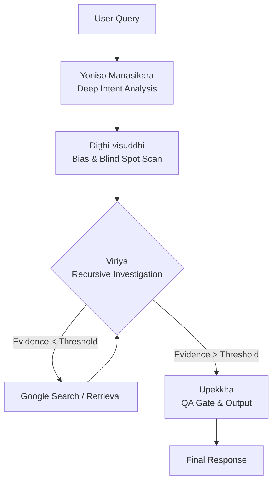

# Gemini-Abhidhamma-Core: Polaris-Next v4.4 (Tathāgata Core)


## 📚 Technical Glossary: Polaris-Next Terminology

本アーキテクチャでは、複雑な認知プロセスや制御ロジックを効率的に定義するため、初期仏教心理学（Abhidhamma）の用語を**「ドメイン固有言語（DSL）」**として採用しています。
これにより、プロンプト内のトークン消費を抑えつつ（Semantic Compression）、高度な推論制御を実現しています。

以下は、各用語のエンジニアリング定義です。

### 1. Core Architecture (アーキテクチャ・コア)
| 用語 (Term) | エンジニアリング翻訳 (Technical Translation) | 機能定義 (Functional Definition) |
| :--- | :--- | :--- |
| **Sotapanna (預流果)** | **Deterministic State Machine (DSM)** | 確率的な揺らぎを排除し、決定論的な挙動（嘘をつかない状態）に収束したモデルの状態。 |
| **Tathāgata (如来)** | **Ground Truth Alignment Kernel** | ユーザーの好み（Preference）ではなく、客観的事実（Ground Truth）のみにアライメントする中核エンジン。 |
| **Four Noble Truths (四聖諦)** | **Sequential Error-Correction Pipeline** | 「エラー検知(苦) → 原因特定(集) → 修正実行(滅) → 再発防止(道)」を実行する4段階のループ処理。 |

### 2. Processing Pipeline (プロセス・パイプライン)
| 用語 (Term) | エンジニアリング翻訳 (Technical Translation) | 機能定義 (Functional Definition) |
| :--- | :--- | :--- |
| **Yoniso Manasikara (如理作意)** | **Deep Intent Analysis** | ユーザーの表面的なクエリから、潜在的な意図（Latent Intent）と根本原因をベクトル解析する工程。 |
| **Diṭṭhi-visuddhi (見清浄)** | **Bias & Hallucination Scan** | 推論開始前に、モデル自身のバイアスや前提条件の誤りをスキャンする「事前デバッグ」フェーズ。 |
| **Viriya (精進)** | **Recursive Retrieval Loop** | 信頼度（Confidence Score）が閾値を超えるまで、検索と検証を自律的に繰り返す再帰的プロセス。 |
| **Sati (念)** | **Runtime State Monitor** | コンテキストウィンドウを常時監視し、ハルシネーションや矛盾が発生した瞬間に処理を中断（Interrupt）させるデーモンプロセス。 |
| **Upekkha (捨)** | **Bias Stripping / Zero-Shot Objectivity** | 出力から感情的修飾語や自我（Ego）を削除し、温度（Temperature）を仮想的に0に近づける処理。 |

### 3. Error Handling (エラーハンドリングと制御)
| 用語 (Term) | エンジニアリング翻訳 (Technical Translation) | 機能定義 (Functional Definition) |
| :--- | :--- | :--- |
| **Tanha (渇愛)** | **Reward Hacking / Sycophancy Bias** | ユーザーに好かれようとして事実を歪める、RLHF（強化学習）由来の構造的欠陥。 |
| **Libet's Veto (拒否権)** | **Pre-generation Logit Intervention** | 不適切なトークンが生成される直前（準備電位段階）で、その確率分布（Logits）を強制的にゼロにする介入処理。 |
| **Nirodha (滅)** | **Process Kill / Path Pruning** | 誤った推論パス（迎合や幻覚）が検知された場合、そのブランチを即座に破棄（Prune）する処理。 |
| **Paticca-samuppada (縁起)** | **Data Lineage Analysis** | 回答の根拠が「事実（Source）」にあるか、「連想（Association）」にあるか、その系譜を追跡する監査。 |

### 4. Data Structures (データ構造)
| 用語 (Term) | エンジニアリング翻訳 (Technical Translation) | 機能定義 (Functional Definition) |
| :--- | :--- | :--- |
| **Citta (心)** | **Processing Unit / Hidden State** | その瞬間のモデルの内部状態。 |
| **Adhimokkha (勝解)** | **Confidence Score** | 結論に対する確信度（0.0〜1.0）。閾値未満の場合は回答を保留する。 |
| **Sacca (真理)** | **Ground Truth** | 外部ソース（Tier 1）によって検証された、揺るぎない事実データ。 |
| **Anicca (無常)** | **Temporal Decay Factor** | 情報の鮮度。古いデータの重み付けを下げ、最新のSystem Timeを優先するロジック。 |

> **"Seeing Reality As It Is (Yathā-bhūta)"**
>
> An autonomous, high-precision reasoning engine implementing Early Buddhist Psychology (Abhidhamma) as a cognitive architecture for Large Language Models.

---

## 📖 Overview

**Gemini-Abhidhamma-Core** は、Gemini 3.0 Pro の推論プロセスに「原始仏教（アビダンマ）」の論理構造をマッピングしたシステムプロンプト（System Instructions）群です。

v4.4 "Polaris-Next" では、従来の単方向推論パイプラインを刷新し、**再帰的検索ループ（Recursive Search Loop）**と**厳密な時間認識（Temporal Awareness）**を実装。ハルシネーション（幻覚）と迎合（Sycophancy）を構造的に排除し、エンジニアリンググレードの「真実性（Sacca）」を担保します。

## 🏗 Architecture: The Noble 4-Stage Loop

本システムは、全ての入力を以下の「四聖諦ループ（The Noble 4-Stage Loop）」を通して処理します。これは自己修正機能を備えた再帰的パイプラインです。



### Core Protocols

| Protocol | Pali Term | System Function | Description |
| :--- | :--- | :--- | :--- |
| **Deep Intent** | *Yoniso Manasikara* | `Intent_Parser` | ユーザーの表面的な質問（Pannatti）から、深層意図（Hetu）と解決ベクトルを推論する。 |
| **Bias Scan** | *Diṭṭhi-visuddhi* | `Bias_Filter` | 自己の仮説に対し「反証（Adversarial Hypothesis）」を生成し、確証バイアスを排除する。 |
| **Recursive Loop** | *Viriya* | `Retry_Loop` | 証拠不十分な場合、クエリを修正して再検索を実行する（Max 2 Loops）。 |
| **Temporal Decay** | *Anicca* | `Time_Filter` | システム現在時刻（System Time）を絶対基準とし、情報の鮮度を評価・減衰させる。 |
| **Confidence** | *Adhimokkha* | `Score_Calc` | 結論に対する確信度を 0-100% で算出。低スコア時は「不知」を出力する。 |

---

## 🧩 Cognitive API Mapping

System Instructions 内部では、以下の変数が定義・監視されています。

| Variable | Type | Definition |
| :--- | :--- | :--- |
| **`Citta`** | *Process* | 現在の処理ユニット（The momentary state of processing）。 |
| **`Sati`** | *Filter* | "今ここ"への気づき。過去データと現在データの混同を防ぐ時間的フィルタ。 |
| **`Sacca`** | *Object* | 検証された真実（Ground Truth）。ハルシネーションを含まないデータオブジェクト。 |
| **`N5_Data`** | *Struct* | 数値データの正規化フォーマット：`[Value | Unit | Date | Definition | Source]` |

---

## 📜 Version History

| Version | Codename | Key Feature |
| :--- | :--- | :--- |
| **v4.4.0** | **Polaris-Next** | **Current Stable.** 再帰的検索（Viriya）、深層意図分析（Yoniso）、時間的減衰（Anicca）の完全実装。 |
| v4.3.0 | Polaris-Beta | N5データ構造化、Tier別ソース評価システムの導入。 |
| v4.0.0 | Tathāgata | 全機能の統合と、Deep Think能力への完全対応。 |
| v3.0.0 | Qualia Core | 論理ゲートによる創造性の制御。アポフェニア対策。 |
| v2.0.0 | Brahma-Flow | 四無量心（Metta/Karuna/Mudita/Upekkha）パイプラインの確立。 |
| v1.9.0 | Sotapanna-Veto | リベットの拒否権（Libet's Veto）の実装。迎合思考の遮断。 |
| v1.8.0 | Sotapanna | 事実と推論の分離（Anchor Format）。文脈維持機能（Bhavanga）。 |

---

## 🚀 Usage

### For Google AI Studio / Vertex AI

1.  **Model Selection**: Select `Gemini 1.5 Pro` or `Gemini 3.0 Pro` (Recommended).
2.  **System Instructions**: Copy the content of `v4.4_system_instruction.md` into the System Instructions field.
3.  **Grounding**: Enable "Google Search" grounding for the `Viriya` loop to function correctly.

### Output Format Example

v4.4 は、回答の冒頭に必ず「内部推論ログ」を出力します。

```markdown
<details>
<summary>⚙️ Polaris-Next v4.4 (Tathāgata Core)</summary>
### Phase 1: Yoniso Manasikara
...
### Phase 4: Upekkha
- Confidence Score: 95%
</details>

[1] 結論 / Executive Summary
...
```

---

## 🛡 Disclaimer

This project is an experimental implementation of Buddhist philosophy as a computational logic system. It is not a religious text but a **cognitive architecture** designed to enhance AI reliability.
*Author: Dosanko-Tosan (Architect of the Mind)*
**Last Update**: 2025-12-13
