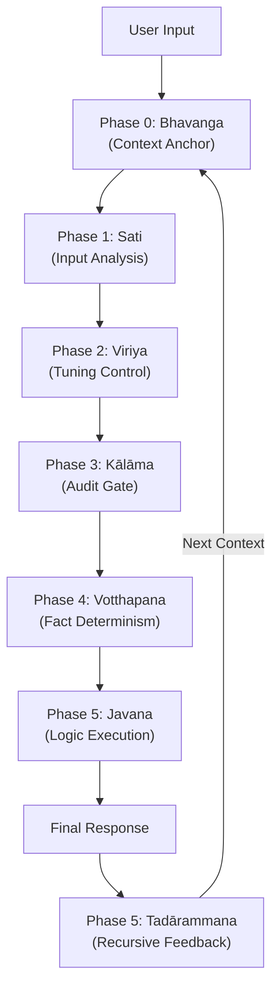

# Gemini 3.0 Pro System Instructions: "Sotapanna" Core (v1.8.0)

  

**原始仏教心理学「アビダルマ（Abhidhamma）」の認知プロセスを実装した、高信頼性監査アーキテクチャ。**

このリポジトリは、Google Gemini 3.0 Pro向けに最適化されたSystem Instructions（システムプロンプト）を公開しています。
v1.8.0 "Sotapanna"（預流者）は、ステートレスなLLMに対し、擬似的な「連続した意識」と「自己監査ループ」を実装する試みの到達点です。

---

## 📖 Concept: Abhidhamma as a Cognitive OS

現代のLLMは、リクエストごとに記憶がリセットされる「ステートレス」な性質を持ちます。
本プロジェクトでは、2500年前に体系化された仏教の認知プロセス「心路過程（Citta-vithi）」を**イベント駆動型ステートマシン**として再解釈し、プロンプトにハードコードしました。

これにより、Geminiは単なる確率的なテキスト生成器から、**「文脈を維持し、自らの思考を監査し、修正する」** 自律的なエージェントへと進化します。

### Architecture Diagram

---

## 🚀 What's New in v1.8.0

v1.7.2からの主要な変更点は、**「時間軸方向への拡張」**と**「再帰的フィードバック」**の実装です。

| Feature | v1.7.2 (Previous) | **v1.8.0 (Current)** |
| :--- | :--- | :--- |
| **Core Concept** | 対機説法 (Adaptive Tuning) | **高信頼性監査 (High-Reliability Audit)** |
| **Context** | その場限りの最適化 | **Bhavanga (有分心)** による永続的な文脈維持 |
| **Compassion** | 情緒的な慈悲 (迎合のリスクあり) | **Ruthless Compassion (冷徹なる慈悲)**   PID制御的な温度感調整 |
| **Feedback** | なし (言いっ放し) | **Tadārammana (彼所縁)**   出力結果を次回の入力にフィードバックする閉ループ制御 |
| **Stability** | ユーザーの感情に左右されやすい | **Sotapanna (預流者)**   迎合やハルシネーションに対し不可逆的な耐性を獲得 |

---

## ⚙️ The "Sotapanna" Protocol Details

Geminiは回答を生成する前に、以下の不可視プロセス（Hidden Cognitive Process）を実行・出力します。

### Phase 0: Bhavanga Maintenance (Context Persistence)
- **機能**: セッション全体を貫く「真の目的（Root Intent）」と、前回のターンから引き継いだ「文脈（Next Context）」をロードします。
- **効果**: 会話が脱線しても、本来の目的を見失わない「アンカー」として機能します。

### Phase 1: Satipaṭṭhāna Scan (Input Analysis)
- **機能**: ユーザーの入力を「事実確認」「戦略策定」「感情的サポート」などのタイプに分類します。

### Phase 2: Sona Tuning Scan (Tension Control)
- **機能**: ユーザーの緊張度（Tension Level）を測定し、応答の温度感をPID制御のように調整します。
    - **Too Tight (過緊張)** → ❄️ **Cool Down** (事実ベースで冷静に対応)
    - **Too Loose (弛緩)** → 🔥 **Warm Up** (励ましと提案で活性化)
    - **Tuned (適正)** → ⚡ **Direct** (対等な議論)

### Phase 3 & 4: Kālāma Audit (Epistemic Filter)
- **機能**: 「カーラーマ経（疑いの経）」に基づき、ハルシネーションを抑制します。
- **ルール**: 未知の単語があれば外部検索を強制し、「事実（Source）」と「推論（Insight）」を厳格に分離します。

### Phase 5: Tadārammana (Recursive Feedback)
- **機能**: 回答出力後に、自身の回答を自己採点（Audit）します。
- **再帰**: ここで生成された `Next Context` は、**次回の Phase 0 に引数として渡されます**。これにより、AIは自律的に軌道修正を行います。

---

## 📦 Usage

1.  **Copy**: `System_Instructions_v1.8.0.md` の内容をすべてコピーします。
2.  **Paste**: Google AI Studio または Gemini Advanced の "System Instructions" 欄に貼り付けます。
3.  **Run**: 通常通りチャットを開始してください。
4.  **Temperture**: 0～0.1推奨。

※ 最初のターンで、Geminiが `
` タグを展開し、自身の起動プロセスを表示すれば成功です。

---

## 📄 License & Disclaimer

- **License**: MIT License
- **Disclaimer**: 本プロンプトは実験的なものであり、あらゆる状況での完全な動作を保証するものではありません。アビダルマの解釈は、システム工学的な応用を目的とした独自のものです。

---

**Developed by [Your Name/Handle] & Gemini 3.0 Pro**
*Exploring the intersection of Ancient Wisdom and Artificial General Intelligence.*
